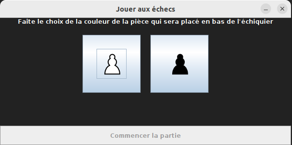
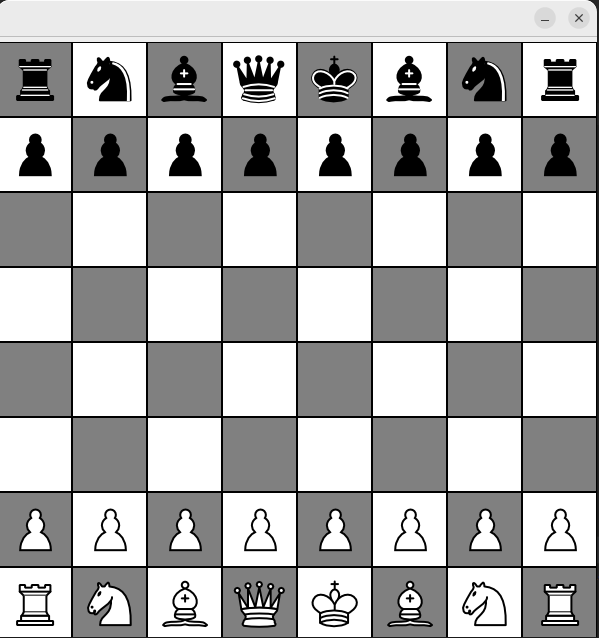
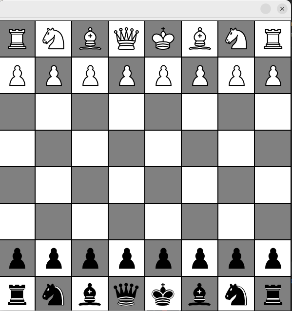
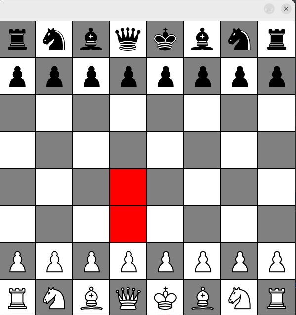
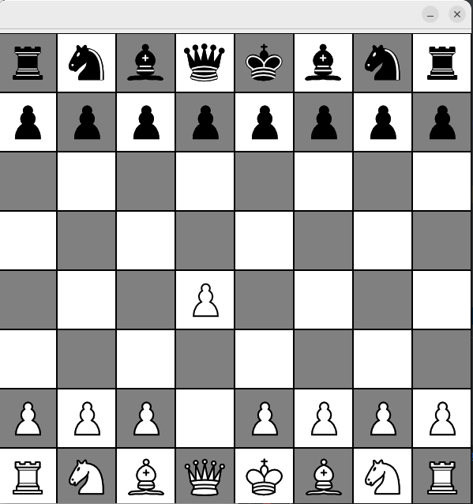
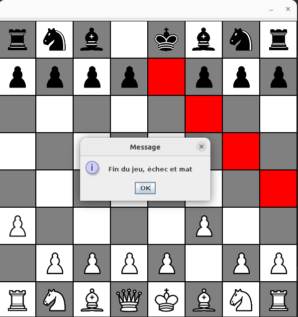
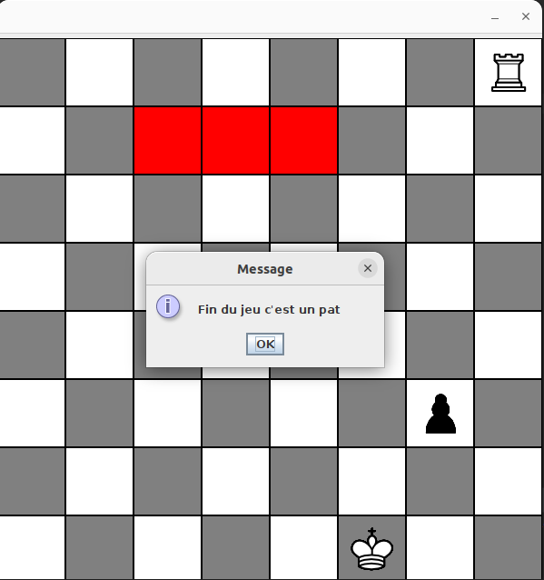

# Uitlisation du programme

Notre jeu d'échecs est une application Java qui permet aux joueurs de jouer 
au célèbre jeu d'échecs. Lancer la version classic du jeu en exécutant le fichier main,
de même pour la version variant qui se trouve dans le module ChessVariant ou utilisé les fichiers 
jar se trouvant dans le repertoire docs/jarFile ou out/artifacts. Lorsque le jeu est lancé, un pop-up s'ouvre 
pour permettre au joueur de choisir la couleur des pièces qu'il souhaite jouer avec.

Si le joueur choisit la couleur blanche, ses pièces seront placées en bas du plateau
de jeu.

Sinon elles seront placées en haut.

Une fois la couleur choisie, le joueur peut commencer à jouer en sélectionnant une 
de ses pièces et en cliquant sur une des cases de déplacement possibles mises 
en surbrillance.

Si le déplacement est valide, la pièce sera déplacée et le tour
passera à l'autre joueur. Si le déplacement est invalide, le joueur est invité à 
jouer de nouveau.

Le jeu se poursuit ainsi jusqu'à ce qu'un joueur mette l'autre joueur en échec et mat,
ce qui signifie que le roi du joueur est menacé et qu'il n'a aucun mouvement valide 
pour l'éviter. Dans ce cas, un pop-up s'ouvre pour signaler la fin de la partie. 

Si aucun joueur n'a la possibilité de mettre 
l'autre en échec et mat, il peut y avoir un match nul, appelé pat.
Dans ce cas, un pop-up s'ouvre pour signaler la fin de la partie et aucun joueur ne
gagne.

 L'interface utilisateur est simple et facile à utiliser,
avec des pièces facilement reconnaissables et des mouvements de déplacement clairement 
indiqués. La fenêtre de jeu et le pop-up de fin de partie se ferment automatiquement
une fois que le joueur a cliqué sur le bouton "OK", signalant ainsi la fin de la 
partie.
